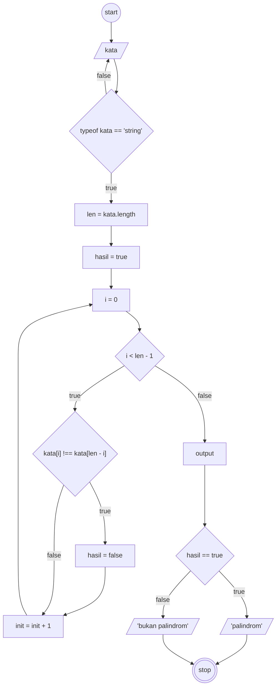
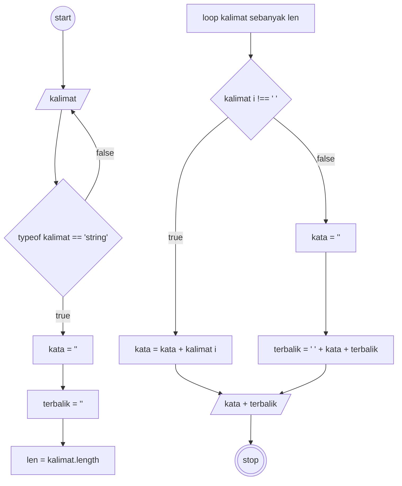

# Algoritma Mendeteksi Palindrom

### Algoritma Deskriptif

1. mulai
1. masukkan sebuah kata
1. periksa apakah itu sebuah kata
1. jika benar maka lanjut ke langkah 6
1. jika tidak maka kembali ke langkah 2
1. hitung panjang kata sebagai **"len"**
1. tentukan variabel hasil sebagai 'benar' untuk pertama kali
1. buatlah variabel i dengan nilai 0 untuk inisialisasi perulangan
1. periksa setiap huruf dalam kata tersebut dari awal sampai akhir, apakah huruf dengan urutan ***i*** sama dengan huruf dengan index ***len - 1 - i***
1. jika ada yang tidak sama maka ubah hasil menjadi 'salah'
1. tambah i dengan 1 setiap selesai 1 perulangan
1. ulangi sampai i sama dengan len
1. buatlah variabel output
1. jika hasil benar tampilkan 'kata ini palindrom'
1. jika tidak maka tampilkan 'kata ini bukan palindrom'
1. selesai

### Algoritma Flowchart

---

# Algoritma membalikkan kalimat

### Algoritma Deskriptif

1. mulai
1. masukkan sebuah kalimat
1. periksa apakah input berupa kalimat
1. jika benar maka lanjut ke langkah 6
1. jika tidak maka kembali ke langkah 2
1. siapkan variabel 'kata' untuk mengumpulkan karakter menjadi kata
1. siapkan variabel 'terbalik' untuk mengumpulkan kata yang sudah terkumpul
1. hitung panjang kalimat sebagai ***'len'***
1. lakukan perulangan sebanyak ***'len'*** untuk memeriksa setiap karakter dalam kalimat dari awal sampai akhir
1. jika bukan karakter spasi maka masukkan karakter tersebut ke variabel 'kata' yang ditambahkan setelah isi variabel 'kata' sebelumnya
1. jika karakter spasi maka isi variabel 'terbalik' dengan spasi ditambah variabel 'kata' ditambah variabel 'terbalik' yang sudah terisi sebelumnya
1. tampilkan variabel 'terbalik'
1. selesai

### Flowchart

