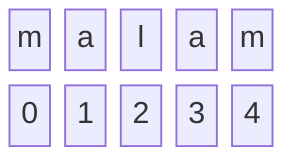

# WEEKLY TASK WEEK 1

First week focuses on strenghtening fundamental thinking of basic algorithm. It is highly urged not to use any built-in method to know how actually the logic works.
Like in reversing word, it is quite easier to reverse using Array.reverse() but it doesnt tell us how this logic works under the hood.
It is much easier to not use array if data is string, since ***string can be accessed using index*** like array.

### Palindrom Check Algorithm

Palindrom is a word that reads the same backward as forward. To check whether the word is palindrom can be achieved by two ways, at least:

#### *First, reverse the word then compared it with the initial word*
#### *Second, we can immediately compare both end of words, edge to middle*

The first one is quite common to use, thus the second one will be discussed further.
Since string can be accessed using index, we can use this condition
```c
if (word[i] == word[word.length - 1 - i])
```
***i*** is the initial value of loop, hence the index is relative to each loop according to initial value.

Before we start the loop we have to set the initial condition ***true*** that the word asked is palindrom. Later the condition might change it if any comparison within the loop is not same.

Let's try with the word **'malam'**

since the initialization(i) begin with 0, the first loop will compare both end.

```c
word[0] !== word[word.length - 1 -0]

// word.length should be decreased by to get the end of index in the string
// thus it will be like follows

word[0] !== word[4]

// the next loop will come inward gradually

word[1] !== word[3]

// and the middle one will compared with its ownself

word[2] !== word[2]
```

This condition is just to verify if any letters are not the same when compared, if all of them are same the initial result remains true. Hence, we should add process when condition is satisfied

```c
if (word[i] !== word[word.length - 1 - i]) {
    result = false
}
```
This condition will ***re-assign*** the initial value of result. It is not necessary to add any ***if else*** or ***else*** after this condition.

Then output the result. If the result remain ***true*** the word is palindrom, else if it becomes ***false*** then it is not palindrom.